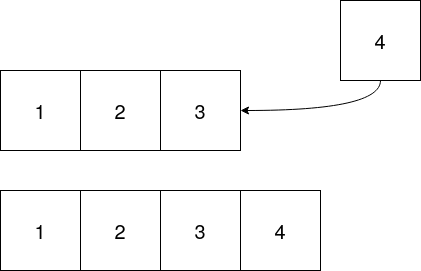
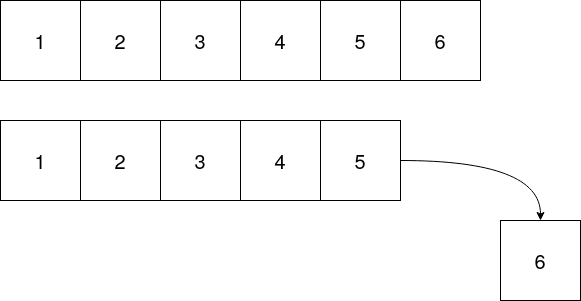
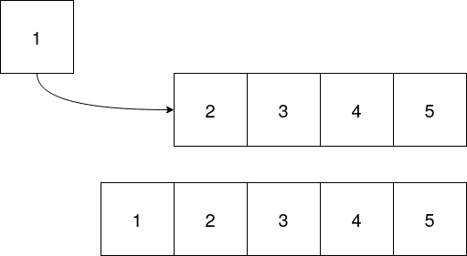
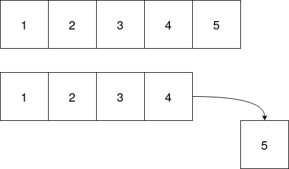

# FinalHomework
Homework on Stacks and Queues
## Objective
Use the `GeneralList.hpp` from the last homework to implement a Queue in `GeneralQueue.hpp` and a Stack in `GeneralStack.hpp`. The function prototypes have been provided as well as a bit of functions. Most of methods in the Queue and Stack classes will be calling the appriate method from `GeneralList.hpp`. In the images below, all of these can be done with a doubly linked list with `push_front`, `push_back`, `pop_front`, and `pop_back` (this is a hint).
## Adding to a stack


## Removing from a stack


## Adding to a queue


## Removing from a queue


## Search function for GeneralList.hpp
```c++
bool search(Data search_value) {
    Dlist *temp;
    for(temp=_front; temp!=nullptr; temp=temp->next) {
      if(temp->value == search_value) {
        return true;
      }
    }
    return false;
}
```

# Rubric
    1. Implementation of Stack.hpp - 25%
    1. Implementation of Queue.hpp - 25%
    1. main.cpp runs without error - 30%
    1. Clean code - 20%
